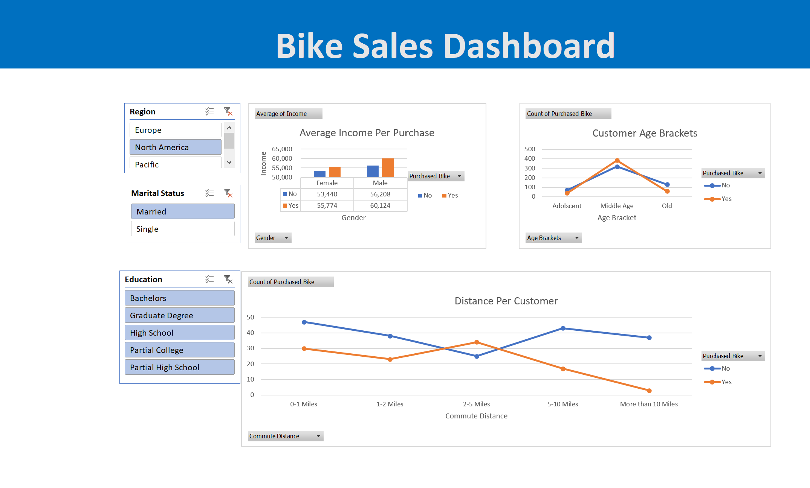

# 📊 End-to-End Enterprise Data Architecture: Bike Sales Systemic Analysis

## 🖼️ Architecture & Dashboard Preview

## 🎯 Architectural Objective
This project serves as a comprehensive case study demonstrating the capability of **Microsoft Excel as a self-contained, end-to-end Data Lifecycle Management platform**. The core objective was to ingest a highly volatile, uncleaned, and unstructured transactional dataset, systematically process it through a rigorous ETL (Extract, Transform, Load) pipeline, establish a robust data model, and deploy an interactive executive dashboard—all without relying on external databases, Python, or specialized BI software.

---

## 🔬 Theoretical Framework: Ingesting & Engineering Messy Data

Raw operational data is inherently fragile, plagued by inconsistent formatting, missing attributes, and logical anomalies. To transform this raw "data swamp" into an analytics-ready information store, a structured **3-stage Excel Data Engineering Methodology** was executed:

### 1. The Extract & Diagnostic Phase (Data Auditing)
Before alteration, the schema was audited to identify operational integrity issues:
* **Structural Anomalies:** Identifying redundant dimensions, trailing whitespace errors, and data type mismatches (e.g., numeric values saved as text strings).
* **Null Value Resolution:** Assessing missing entries to determine if they required mathematical imputation, default placeholder assignment, or systemic deletion.

### 2. The Transform Phase (Systemic Data Cleaning inside Excel)
Data cleansing was standardized using core programmatic principles inside Excel to eliminate manual human error:
* **De-duplication & Schema Alignment:** Deduplication engines were used to isolate and purge exact row duplicates, securing statistical uniqueness.
* **String Normalization:** `UPPER`, `LOWER`, and `PROPER` text nesting formulas eliminated variant spelling. Abbreviated classification schema values (like "M"/"S" or "M"/"F") were programmatically mapped to explicit dimensions ("Married"/"Single", "Male"/"Female") via lookup matrices to eliminate downstream categorization bias.
* **Algorithmic Discretization (Data Binning):** Continuous variables (like raw numbers for `Age`) create fragmented data points. To build coherent analytical categories, logical nesting engines (`IFS` and nested `IF` statements) were deployed to dynamically classify continuous integer arrays into rigid, discrete categorical brackets (`Adolescent`, `Middle-Aged`, `Senior`).

### 3. The Load & Modeling Phase (Establishing Single Source of Truth)
Transforming cleaned tabular data into a structured layout required decoupling the data layer from the presentation layer:
* **Relational Normalization:** Dynamic formulas like `XLOOKUP` and index-matching schemas linked disparate database arrays together.
* **Data Aggregation via Multi-Dimensional Tables:** Cleaned outputs were routed into specialized Pivot Cache engines, creating a semantic layer capable of multi-axis slicing without straining local processing memory.

---

## 🛠️ The Excel Technical Stack & Tool Pipeline

Excel’s internal computation engine was leveraged to function exactly like an enterprise data warehouse stack:

* **ETL Engine / Functions:** Automated formulas handled logical evaluation, data mapping, and string cleanup (`XLOOKUP`, `IFERROR`, `LEFT/RIGHT` parsing, and boolean `AND/OR` criteria arrays).
* **Data Modeling Layer:** Pivot Tables acted as the analytical engine, running automated background aggregations (Sums, Averages, Distinct Counts) based on complex dimensional interactions (e.g., mapping Average Income against Purchase Conversion).
* **Interactive UI/UX Layer:** Interconnected **Slicers** and **Timelines** were cross-filtered across multiple Pivot Caches. This acts as a decoupled front-end graphical user interface, instantly recalculating the backend math whenever a user interacts with a filter button.
* **Visual Representation Layer:** Clean, cognitive-load-optimized visual schemas (Clustered Columns, Trend Lines, KPI Scorecards) were styled to emphasize critical margins, ensuring immediate human interpretation without visual clutter.

---

## 💡 Analytical Insights & Demographic Theories
By isolating specific socioeconomic dimensions against bike purchasing decisions, several distinct behavioral trends were exposed:
* **The Income Threshold Hypothesis:** A direct positive correlation exists between specific disposable income tiers and vehicle acquisition, with the highest concentration of conversions living in the middle-aged demographic bracket.
* **Commute Elasticity:** Customer conversion drops significantly as commute distance scales beyond a specific micro-radius. Individuals with short commutes (0-1 miles) possess a significantly higher propensity to purchase, defining the asset primarily as a localized utility or wellness product.
* **Demographic Stability Markers:** Homeownership status and marital status act as strong indicators of purchasing power stability, outperforming general regional variables during predictive market scaling analysis.

---

## 📥 Deployment & Local Reproduction Instructions
To interact with the processing layers and the live analytical interface, download the compiled architecture directly:
1. Navigate to the file repository structure above.
2. Select the **`[Your_File_Name].xlsx`** binary file workbook.
3. Click the **Download raw file** action button to clone it to your local environment.
4. Launch the project via desktop **Microsoft Excel** (activate macros/content if prompted).
5. Interact with the dynamic slicer grid on the dashboard tab to watch the backend calculations compute in real-time.

